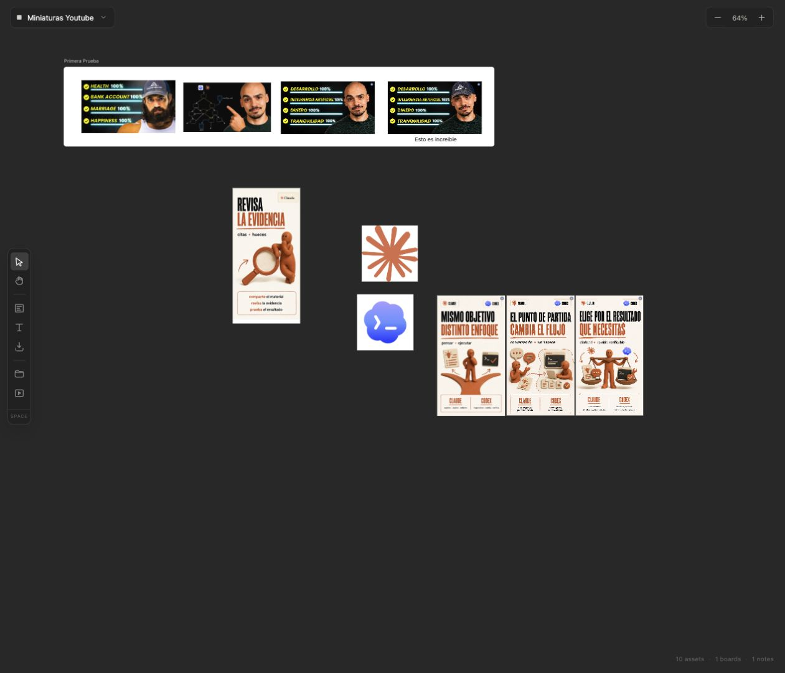

# Codex Canvas

Codex Canvas es un espacio visual local para organizar Assets, Boards y Notes, preparar referencias y trabajar con Codex. La interfaz está inspirada en un Canvas espacial tipo Paper, pero el proyecto se ejecuta en tu propio Mac y guarda el trabajo localmente.



## Qué incluye

- Canvas oscuros con zoom, desplazamiento y selección por marco.
- Importación de una o varias imágenes desde Finder, arrastrando, pegando desde el portapapeles o usando el selector de archivos.
- Selección con clic, `Shift` + clic y marquee selection.
- Movimiento y redimensionado de Assets, Notes y Boards.
- Boards blancos con título editable, membresía de Assets y bloqueo opcional.
- Notes editables con tamaño, color de texto, fondo, transparencia y alineación izquierda, centro o derecha.
- Catálogo local de varios Canvas.
- Asset Library local para guardar Assets reutilizables y arrastrarlos a cualquier Canvas.
- Preview contextual para comprobar una miniatura en superficies de YouTube y carruseles.
- Integración MCP local para que Codex pueda leer la selección, importar imágenes y devolver Assets generados al Canvas.

La aplicación no llama directamente a una API de generación de imágenes. Codex es la superficie de trabajo para buscar, razonar y generar; Canvas recibe y organiza el resultado.

## Requisitos

- macOS con Node.js 20 o superior.
- npm, incluido con Node.js.
- Codex Desktop o un cliente compatible con MCP si quieres usar la integración con Codex.
- No necesitas una base de datos, un servicio remoto ni una API key para arrancar la aplicación local.

## Instalación

Clona el repositorio e instala las dependencias:

```bash
git clone https://github.com/NicoCMW/paper.git
cd paper
npm install
```

## Arrancar la aplicación

La forma habitual inicia el runtime local y el frontend:

```bash
npm run dev
```

Después abre [http://127.0.0.1:5173](http://127.0.0.1:5173).

Los servicios son:

- Frontend Vite: `http://127.0.0.1:5173`
- Runtime local y HTTP API: `http://127.0.0.1:29980`
- MCP de Canvas: `http://127.0.0.1:29980/mcp`
- Health check: `http://127.0.0.1:29980/health`

Si necesitas arrancarlos por separado, usa dos terminales:

```bash
# Terminal 1
npm run dev:server
# Terminal 2
npm run dev:web
```

## Configurar Codex

El runtime local expone un servidor MCP por HTTP. En la configuración MCP de Codex añade un servidor con estos valores:

```text
Nombre: codex-canvas
URL: http://127.0.0.1:29980/mcp
Transporte: Streamable HTTP
```

Con el runtime levantado, Codex puede descubrir herramientas como:

- `canvas_list`, `canvas_create`, `canvas_switch` y `canvas_rename`.
- `canvas_get_state` y `canvas_get_selection`.
- `canvas_select_assets` y `canvas_group_selection`.
- `canvas_import_asset`.
- `canvas_receive_generated_asset`.
- `canvas_undo` y `canvas_redo`.

Flujo recomendado para generar una imagen:

1. Selecciona las imágenes de referencia en el Canvas.
2. Abre una nueva tarea de Codex con el runtime MCP activo.
3. Pide a Codex que use los Assets seleccionados como referencia y describe el resultado que quieres.
4. Codex lee la selección, genera la imagen y la devuelve al Canvas como un nuevo Asset.

La aplicación no tiene un compositor de prompts propio en esta iteración: la instrucción se escribe en la conversación de Codex.

## Uso básico

### Importar Assets

Puedes arrastrar imágenes desde Finder al Canvas, pegarlas desde el portapapeles, seleccionar varias desde el botón de importar o arrastrarlas desde la Asset Library.

### Organizar el Canvas

- Usa el puntero para seleccionar y mover.
- Mantén `Shift` para añadir o quitar elementos de la selección.
- Arrastra sobre un espacio vacío para crear una selección rectangular.
- Usa la herramienta Board y arrastra para crear un Board blanco.
- Haz doble clic en el título de un Board para cambiarlo.
- Selecciona un Board para bloquearlo o desbloquearlo.
- Usa la herramienta Note para dibujar una caja de texto.

### Redimensionar

Un Asset se redimensiona desde las esquinas manteniendo su proporción. Un Note se puede redimensionar desde sus ocho manejadores: esquinas y laterales. El recuadro azul sigue el tamaño provisional mientras arrastras.

### Preview

Selecciona uno o varios Assets y pulsa `Preview`. Puedes alternar entre YouTube y carrusel, cambiar el dispositivo, editar el título de YouTube y regenerar el contexto de miniaturas aleatorias.

## Persistencia local

El runtime crea esta carpeta en la raíz del proyecto:

```text
.paper-data/
├── state.json    # Canvas, Boards, Notes, selección y Asset Library
└── assets/       # bytes de las imágenes importadas o generadas
```

El estado permanece después de cerrar y volver a arrancar el servidor. `.paper-data/` está excluida de Git para que las imágenes y el trabajo privado no se publiquen en GitHub.

Si quieres guardar los datos en otra ubicación:

```bash
PAPER_DATA_DIR=/ruta/absoluta/a/mi-canvas npm run dev
```

Para hacer una copia de seguridad, detén el runtime y copia la carpeta `.paper-data/` completa.

## Comandos de desarrollo

```bash
npm run typecheck   # Comprueba los tipos
npm test -- --run   # Ejecuta los tests
npm run build       # Genera el build de producción
```

## Estructura principal

```text
src/domain/     # Modelo y módulo profundo Workspace
src/client/     # Canvas, interacción y presentación React
src/server/     # Persistencia local, HTTP y adaptador MCP
public/         # Assets públicos del frontend
docs/           # ADRs, dirección visual y capturas de documentación
.scratch/       # Especificaciones e issues locales
```

## Solución de problemas

### El frontend no carga

Comprueba que `npm run dev` sigue ejecutándose y abre de nuevo `http://127.0.0.1:5173`. Si el puerto está ocupado, cierra el proceso anterior antes de arrancar otro.

### Codex no ve el Canvas

Comprueba que el runtime responde en [http://127.0.0.1:29980/health](http://127.0.0.1:29980/health) y que la configuración MCP apunta exactamente a `http://127.0.0.1:29980/mcp`. Después abre una nueva tarea de Codex para que vuelva a descubrir las herramientas.

### No aparecen mis Assets después de reiniciar

Verifica que estás arrancando el runtime desde la raíz del repositorio y que `.paper-data/state.json` y `.paper-data/assets/` siguen presentes. Si usaste `PAPER_DATA_DIR`, debes volver a iniciar con la misma ruta.

## Alcance actual

Codex Canvas es una herramienta privada y local. No incluye publicación a Drive, CMS, redes sociales, colaboración remota ni persistencia en la nube. Esas integraciones quedan fuera de este slice hasta que el flujo local esté completamente consolidado.
